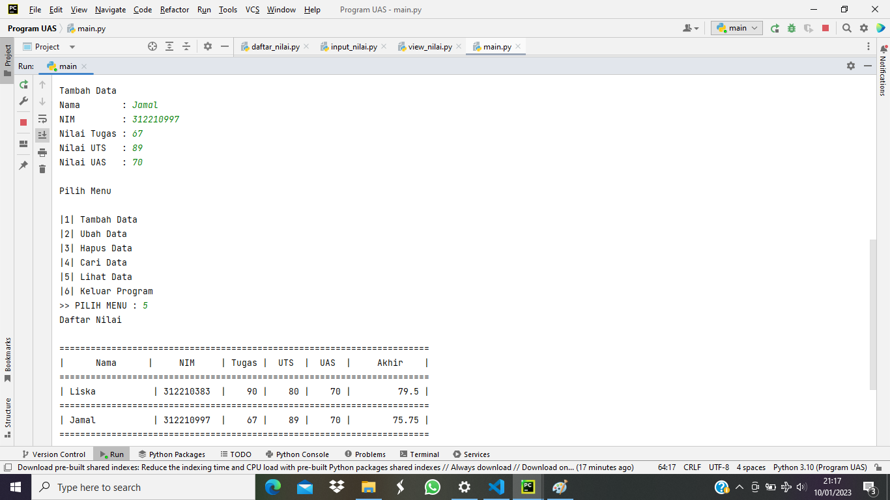
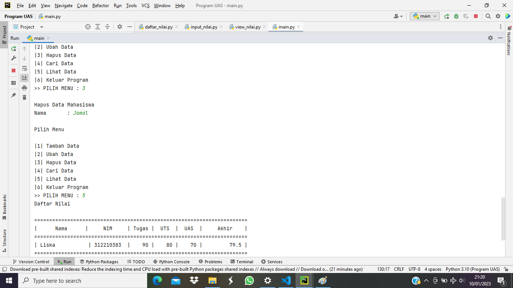
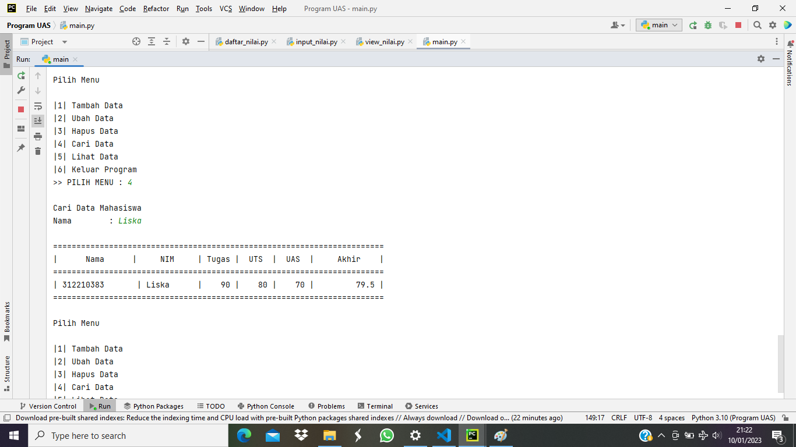
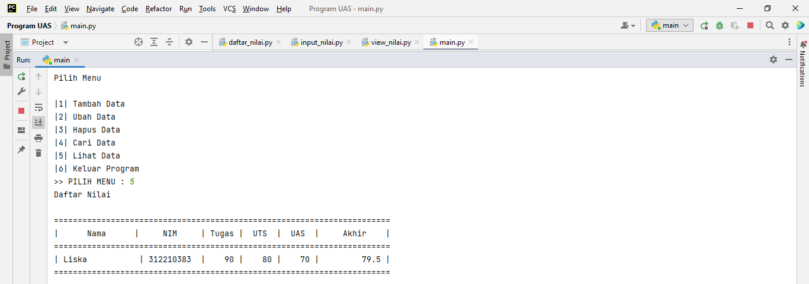
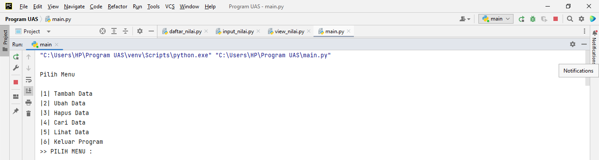

# Project-UAS

# Link Youtube
https://youtu.be/9fEPWb7Dshw

## Penjelasan
Pada directory model dan view merupakan sebuah package yang di dalamnya terdapat sekumpulan modul python yang berada dalam sebuah folder serta memiliki satu modul constructor `__init__.py`.

Dengan struktur, seperti pada package model yang isinya terdapat modul `daftar_nilai.py` serta file python yang bernama `__init__.py`. Sedangkan package view yaitu isinya terdapat modul `input_nilai.py` dan `view_nilai.py` serta file python juga yang bernama `__init__.py`.

Pada file python `__init__.py` berfungsi untuk memberi tahu python interpreter bahwa folder tersebut adalah sebuah package. Jadi setiap direktori atau folder yang berisi modul constructor `__init__.py` akan diperilakukan sebagai package. Sedangkan file python `main.py` berisi program utama (menu pilihan yang memanggil semua menu yang ada).

## 1. Model
### daftar_nilai.py
Pada file daftar_nilai.py dalam sebuah package model yaitu berisi modul untuk : tambah_data, ubah_data, hapus_data, dan cari_data.

#### Tambah Data
Fungsi `tambah_data()` untuk menambahkan data mahasiswa seperti nama, nim, nilai tugas, nilai uts dan nilai uas dengan menggunakan fungsi `nama_input()`, `nim_input()`, `tugas_input()`, `uts_input()`, `uas_input()`. Data yang diinput akan masuk ke dalam direktori `data_mahasiswa = {}`.
```python
data_mahasiswa = {}

def tambah_data():
    global data_mahasiswa
    print()
    print("Tambah Data")
    nama = nama_input()
    nim = nim_input()
    tugas = tugas_input()
    uts = uts_input()
    uas = uas_input()
    nilai_akhir = (tugas * 30 / 100) + (uts * 35 / 100) + (uas * 35 / 100)
    data_mahasiswa[nama] = [nim, tugas, uts, uas, nilai_akhir]
    return data_mahasiswa
```

#### Output Tambah Data



#### Ubah Data
* Fungsi `ubah_data()` untuk mengubah data mahasiswa berdasarkan nama, lalu masukkan data yang ingin diubah.
* Jika sebelumnya belum menginput data, maka akan ditampilkan tulisan `Data nilai{0} tidak ada`.
```python
def ubah_data():
    print()
    print("Ubah Data Mahasiswa")
    nama = input("Nama        : ")
    if nama in data_mahasiswa.keys():
        nim   = input    ("NIM         : ")
        tugas = int(input("Nilai Tugas : "))
        uts   = int(input("Nilai UTS   : "))
        uas   = int(input("Nilai UAS   : "))
        nilaiakhir = ((tugas) * 30 / 100 + (uts) * 35 / 100 + (uas) * 35 / 100)
        data_mahasiswa[nama] = [nim, tugas, uts, uas, nilaiakhir]
    else:
        print("Data nilai{0} tidak ada".format(nama))
```

#### Output Ubah Data


#### Hapus Data
* Fungsi `hapus_data()` untuk menghapus data mahasiswa berdasarkan nama.
* Jika sebelumnya belum menginput data, maka akan ditampilkan tulisan `Data {0} tidak ada`.
```python
def hapus_data():
    print()
    print("Hapus Data Mahasiswa")
    nama = input("Nama       : ")
    if nama in data_mahasiswa.keys():
        del data_mahasiswa[nama]
    else:
        print("Data {0} tidak ada".format(nama))
    return
```

#### Output Hapus Data



#### Cari Data
* Fungsi `cari_data()` untuk mencari data mahasiswa berdasarkan nama.
```python
def cari_data():
    print()
    print("Cari Data Mahasiswa")
    nama = input("Nama        : ")
    print()
    for nama in data_mahasiswa.items():
        print("=======================================================================")
        print("|      Nama      |     NIM     | Tugas |  UTS  |  UAS  |     Akhir    |")
        print("=======================================================================")
        print(f"| {nama[1][0]:15} | {nama[0]:10} | {nama[1][1]:5} | {nama[1][2]:5} | {nama[1][3]:5} | {nama[1][4]:12} |")
        print("=======================================================================")
```

#### Output Cari Data



## 2. View
### input_nilai.py
`input_nilai.py` berisi modul untuk: `input_data` yang meminta pengguna memasukkan data.

#### Input Data
* Untuk menginput data yang terdiri dari beberapa fungsi yaitu `nama_input()`, `nim_input()`, `tugas_input()`, `uts_input()`, `uas_input()`.
```python
def nama_input():
    global nama
    nama = input("Nama        : ")
    return nama


def nim_input():
    global nim
    nim = input("NIM         : ")
    return nim


def tugas_input():
    global tugas
    tugas = int(input("Nilai Tugas : "))
    return tugas


def uts_input():
    global uts
    uts = int(input("Nilai UTS   : "))
    return uts


def uas_input():
    global uas
    uas = int(input("Nilai UAS   : "))
    return uas
```


### view_nilai.py
`view_nilai.py` berisi modul untuk: `cetak_daftar_nilai`, `cetak_hasil_pencarian`.

#### Lihat Data
* Program dibawah berfungsi untuk mengimport semua modul pada `daftar_nilai` agar dapat di akses kedalam program `view_nilai.py`.
```python
from model.daftar_nilai import*
```

* Fungsi `cetak_daftar_nilai()` untuk melihat data mahasiswa yang sudah diinput sebelumnya.
* Jika belum menginput data, maka akan memanggil fungsi `no_data()`.
```python
def cetak_daftar_nilai():
    if len(data_mahasiswa) <= 0:
        no_data()
    else:
        print("Daftar Nilai")
        print()
        print("=======================================================================")
        print("|      Nama      |     NIM     | Tugas |  UTS  |  UAS  |     Akhir    |")
        print("=======================================================================")
        for a in data_mahasiswa.items():
            print(f"| {a[0]:15} | {a[1][0]:10} | {a[1][1]:5} | {a[1][2]:5} | {a[1][3]:5} | {a[1][4]:12} |")
            print("=======================================================================")


def cetak_hasil_pencarian():
    if len(data_mahasiswa) <= 0:
        cari_data()
```

#### Output Lihat Data



## 3. main.py
Pada modul `main.py` berisi program utama (menu pilihan yang memanggil semua menu yang ada).

### Penjelasan kode program main.py
* Berfungsi untuk mengimport module module yang ada diluar program utama `main.py`.
```python
from view.view_nilai import *
from model.daftar_nilai import *
```

* Terdapat perulangan dan pilihan menu yang terdiri dari tambah data, ubah data, lihat data, hapus data, cari data dan menu untuk keluar dari program.
```python
while True:
    print()
    print("Pilih Menu")
    print()
    print("|1| Tambah Data")
    print("|2| Ubah Data")
    print("|3| Hapus Data")
    print("|4| Cari Data")
    print("|5| Lihat Data")
    print("|6| Keluar Program")
    tanya = int(input(">> PILIH MENU : "))

    if tanya == 1:
        tambah_data()
    elif tanya == 2:
        ubah_data()
    elif tanya == 3:
        hapus_data()
    elif tanya == 4:
        cari_data()
    elif tanya == 5:
        cetak_daftar_nilai()
    elif tanya == 6:
        print("Program Selesai")
        break
```
### Output Program main
